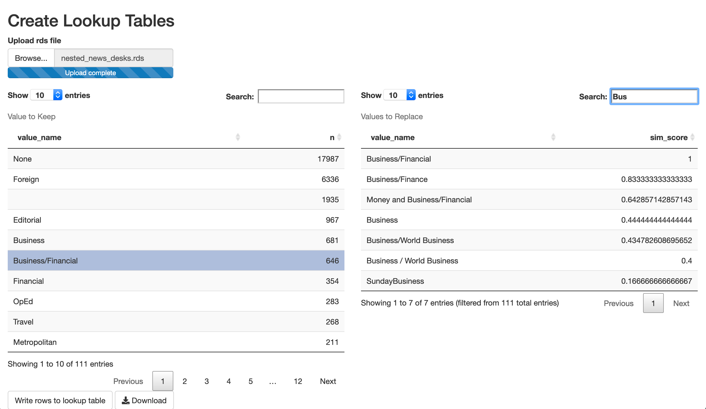

```{r, include = FALSE}
knitr::opts_chunk$set(
  collapse = TRUE,
  comment = "#>"
)
```

For those more interested in the contents of the package rather than analysis of the actual data at hand, here I detail some of the key steps.

```{r setup, message=FALSE}
library(dplyr)
library(nytindia)
```

# Preparing the Data

The main steps for preparing the data found in the Shiny app were to:

- query article data from [The New York Times Article Search API](https://developer.nytimes.com/docs/articlesearch-product/1/overview);
- clean the data, especially consolidating categorical values representing the same entity into one value;
- transform the original data frame, where each row is an article and keywords are a nested column, to an unnested data frame, where each row is a keyword in an article; 
- geocode location keywords using the [Mapquest Geocoding API](https://developer.mapquest.com/documentation/geocoding-api/);
- prepare data on Indian government tenures from [Wikipedia](https://en.wikipedia.org/wiki/List_of_prime_ministers_of_India).

I provide more detail on each of these steps in the sections below.

## Querying the NYT Article Search API

This project started with querying [The New York Times Article Search API](https://developer.nytimes.com/docs/articlesearch-product/1/overview).

My goal was to collect every article in The New York Times "about India" dating back as far as possible. Accordingly, the query string required that all results include:

- an "India" location keyword tag,
- the document type "article",
- and the source be one of "The New York Times", "International New York Times", or "International Herald Tribune".

After reading a few tutorials on querying The New York Times' API, like [this one](http://www.storybench.org/working-with-the-new-york-times-api-in-r/), it was not too difficult to get the results I wanted. 

My code in ``R/01-query-nyt-api.R`` is probably not the most robust script, but the main learning point was to iterate over small chunks of time. 

My query script essentially has two loops:

- The outer loop iterates over time periods.
- The inner loop iterates over page results.

The API returns 10 articles at a time. In order to stay within the limits of the API, you won't get too far querying the full time range all at once because as you paginate through results, the response time slows. When trying to query the results for one year, I wasn't close to reaching the daily limit of 4,000 requests (40,000 articles), but my query was timing out.

Having smaller time chunks ensures having fewer page results for each time chunk. Once switching to a monthly increment, I was able to retrieve all results in one job.

## Consolidating Categories

My API query produced a folder with one file for every year-month combination. The next step was to combine those files into one data frame, remove unnecessary columns, and begin cleaning the data (``R/02-prepare-nested.R``).

Many of the columns in the dataset contained multiple values that represent the same or nearly the same entity.

For example, the raw values for a column like *news_desk* included "Business/Finance", "Money and Business/Financial", "Financial", "Business", "Business/World Business", and "Business / World Business".

The same problem presented itself with a column like keyword values. To give one example, there were nine different attributions all referring to the same person ("Gandhi, Mohandas Karamchand").

I needed to consolidate values referring to the same entity to one single value. I initially approached this problem with a very long `case_when()` statement. This quickly became untenable though as the severity of the problem became apparent.

A more automated solution like fuzzy matching, or approximate string matching, was also not viable as many of the correct matches are not actually that close in terms of string distance. On the other hand, values like "Gandhi, Rahul" and "Gandhi, Rajiv" are close in terms of string distance, but are two different people. Accordingly, all renaming required human review.

My solution was to write a small Shiny app that would make it easy to create lookup tables. The code for this app is included in the package [here](https://github.com/seanangio/nytindia/inst/examples/lookup_table_app). 

I would first create a file with counts of distinct names for a column like news desk or keyword values. I would choose the name I wanted to keep. The app would then sort all of the other values in the column by string distance. Between the similarity score and searching in the DataTable, I was able to find the most likely values to be consolidated under the chosen name. 

{width=75%}

## Nested vs. Unnested Data

Another challenge in preparing the data was handling nested keywords. After combining all of the raw files into one data frame, every record represents one article. (Think of the **Table** tab of the `nyt_india_app`). The keywords for every article are structured as a nested data frame. You can see this in the final nested data frame below.

```{r message=FALSE, echo=FALSE}
full_nested_df <- readRDS("../inst/examples/nyt_india_app/full_nested_df.rds")
glimpse(full_nested_df)
```

The nested *keywords* data frame from the Article Search API includes not only the keyword value, but also a category ("subject", "person", "glocation", "organization", or "creative_work") and its rank of importance in the article. The *lat*, *lon*, and *country* columns are added in the step below. Here's one example:

```{r echo=FALSE}
full_nested_df$keywords[[1]]
```

In preparing the data, {tidyr}'s `nest()` and `unnest()` functions are used for this task. However, in the Shiny app itself, to go from unnested to nested versions, it's faster to just acquire the distinct URLs from the unnested data frame and use that to filter the nested data frame.

## Querying Location Data

Once keyword values were unnested and cleaned, I wanted to join in geographic coordinates in order to visualize the location keywords on a map.

There are a number of free geocoding APIs available, many with R wrappers. I chose to query the [Mapquest Geocoding API](https://developer.mapquest.com/documentation/geocoding-api/) to return a longitude and latitude coordinate for every unique location keyword. I expect there are a few errors, but overall it did a good job.

Again, my script (``R/07-query-mapquest.R``) is likely not the most robust, but, as there were a relatively small number of locations, it wasn't a difficult task. 

Location keywords include both cities and countries. They should really be distinguished in some way before plotting as bubbles on the same map. To achieve this, I joined in a list of country name data in order to identify which keywords are countries. Once again, likely not a perfect list, but it did the job. See ``R/08-add-coords-countries.R`` for details.

## Preparing Government Data

One last piece of data needed was a history of Indian governments. This enabled filtering the dataset by a specific party or prime minister instead of a single date range. It also provided a helpful background for the timeline.

This data came from [Wikipedia](https://en.wikipedia.org/wiki/List_of_prime_ministers_of_India). Instead of scraping it directly, copy-pasting into a Google sheet and then using the {datapasta} package was the easiest way to get the data into R. See ``data-raw/govt.R`` for more details.

```{r echo=FALSE}
glimpse(govt)
```

# Building the Shiny App

The key points for building the Shiny app were:

- simplifying ``ui.R`` with UI functions
- writing the function to filter the unnested data frame
- choosing the visualization libraries for each tab.
- pulling non-reactive code out of ``server.R`` and into functions kept in ``global.R``.

## The UI

The UI for this Shiny app is actually quite simple.

**UI functions**, as described in the [Mastering Shiny book](https://mastering-shiny.org/scaling-functions.html#ui-functions), were a great help to reduce the code in ``ui.R``. There are about 15 inputs just on the **Filters** tab. Most are very similar. 

After writing a ``myInput()`` function, I was able to store most of the input information in one table and call on it with functions. Doing so increased clarity and reduced code duplication.

## Filtering the Unnested Data

The most important function in ``global.R`` is ``filter_unnested()``. It filters the the complete unnested data frame (where each row represents a keyword belonging to an article) based on about 15 different user inputs.

Filtering for some of these inputs like *news_desk*, *section* or *material* is quite simple. Others, such as keyword filtering, require more complicated logic.

When filtering by keywords, you first need to obtain the correct set of article URLs. This is because for visualizations like the keyword pairs or even the bar plot of counts, you want to retain the other keywords in articles matching the filter.

For example, imagine the user wants to filter for all articles with a keyword "pakistan". We need to find the article URLs with the matching keyword, and then use those URLs to filter the dataset. Otherwise, the other keywords in articles with a "pakistan" keyword would be lost, and visualizations like the bar plot or keyword pairs would be empty.

Once you have the correct unnested data frame, you also need a nested version (where each row is an article) that can be used in visualizations like the **Table** or **Timeline**. Instead of going to the trouble of actually nesting it each time though, the ``nest_df()`` function just gets the distinct URLs in the unnested data frame and then performs a join on the full nested data frame.

## Visualizations

Once the correct reactive (nested or unnested) data frame is available, creating the actual visualizations is fairly simple.

- For maps, the obvious choice is {leaflet}.
- For bar plots and the heatmap, I chose {ggiraph}. {plotly} is a popular option, but I've always found {ggiraph} to be very easy to add interactivity to a ggplot. 
- For the timeline, I chose {dygraphs}. {ggplot} + {ggiraph} would have been an option, but I wanted to try out this package dedicated to time series.

## Server Logic

As suggested in [Mastering Shiny](https://mastering-shiny.org/scaling-functions.html#server-functions), I tried to keep all of the non-reactive code outside of ``server.R``.  

Aside from calculating the outputs, most of the code in ``server.R`` is for filtering the data by interacting with the visualizations themselves. Using Shiny with {DT}, {ggiraph}, {dygraphs}, and {leaflet} follows a similar pattern in saving a click event with an ``eventReactive()``.

# Making a Package

This project was originally a typical data analysis project: a series of scripts that produced an output dataset, combined with a shiny app for visualization.

I decided to take it one step further and re-structure it as a package. This makes it easier to update the data every month and was a great learning opportunity.

# Acknowledgements

In addition to the importance of the {[tidyverse](https://www.tidyverse.org/)} and {[shiny](https://shiny.rstudio.com/)} packages, I'd also like to thank the authors of packages such as {[shinyWidgets](https://dreamrs.github.io/shinyWidgets/index.html)}, {[DT](https://rstudio.github.io/DT/)}, {[ggiraph](https://davidgohel.github.io/ggiraph/)}, {[dygraphs](https://rstudio.github.io/dygraphs/)}, {[gt](https://gt.rstudio.com/)}, {[leaflet](https://rstudio.github.io/leaflet/)}, {[bsplus](http://ijlyttle.github.io/bsplus/)},
{[waiter](https://waiter.john-coene.com/#/)}, and 
{[shinycssloaders](https://daattali.com/shiny/shinycssloaders-demo/)}.
